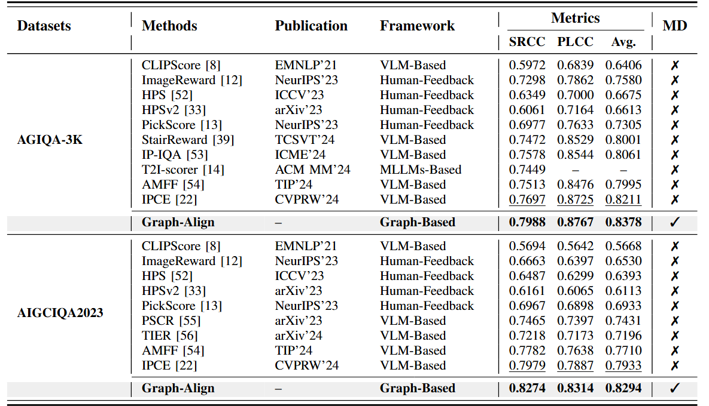

<div align="center">
  <h1>Graph-Align: Evaluating Text-to-Image Alignment with Fine-grained Graph Matching</h1>
  
</div>


<h2> 📖 Abstract</h2> 

Text-to-image (T2I) generation has emerged as a crucial component of AI content creation, but evaluating semantic alignment between generated images and text prompts remains challenging. Existing methods typically use implicit holistic representations from vision-language models, which struggle to capture fine-grained semantic relationships.

**Graph-Align** transforms T2I alignment evaluation into a graph matching problem by:

1. Representing images and text prompts as structured graphs (nodes=entities, edges=relations)
2. Establishing semantic connections through Graph Fusion
3. Identifying prompt-relevant regions via Subgraph Search
4. Calculating alignment scores through graph matching

<h2>📊Results</h2>
<p align="center">
  
</p>


<h2>🏆Performance</h2>
<p align="center">
  
</p>


```markdown
# GraphAlign

GraphAlign is a project for graph alignment and vision-text representation learning.  

## Quick Start

git clone https://github.com/Guapicat0/GraphAlign
cd GraphAlign

# Create conda environment
conda create -n alignment python=3.8
conda activate alignment

# Install dependencies
pip install -r requirements.txt
```

---

<h2>Dataset Preparation</h2> 

Before using GraphAlign, you need to prepare **visual graphs** and **textual graphs**.  

### 1. Visual Graph Generation

You can generate visual graphs using **Scene Graph Generation (SGG)**. There are two options:  

- **Use an external visual graph detector**  
  You may use the detector provided by [OvSGTR](https://github.com/gpt4vision/OvSGTR/) to generate scene graphs.  

- **Use the simplified version we provide**  
  We include a lightweight detector in this repo at:  
  
  ```
  ssg/sg_generation.py
  ```

### 2. Textual Graph Generation

After obtaining visual graphs, you also need to generate graph structures from text prompts.  For this, you can use [prettygraph](https://github.com/yoheinakajima/prettygraph) to convert prompts into text-based graphs.  

how to make visual/textual graph,please see [graph.md](ssg/graph.md) for more details.  

---

<h2>Training</h2> 

Once you have prepared your dataset, you can train your own **Alignment Evaluator** and run validation:  

```bash
python train.py 
```

This will start training the alignment evaluator using your prepared visual and text graphs, followed by validation and evaluation.  

## References

- [OvSGTR: Scene Graph Transformer for Open-Vocabulary Visual Recognition](https://github.com/gpt4vision/OvSGTR/)  
- [PrettyGraph: Convert text prompts into graph structures](https://github.com/yoheinakajima/prettygraph)  


<h2>📧 Contacts</h2> 

For questions and suggestions, please contact:

• Feiyu Lin: linfeiyu@stu.xidian.edu.cn 

• Zhichao Yang: yangzhichao@stu.xidian.edu.cn


